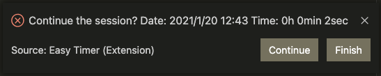

# Easy Timer README

## Features

### -How it works.  
Just click the play button in the status bar to start.

### -How to stop.  
Click the save button in the status bar to finish the session. If you press it for mistake just hit continue or x.

## Extension Settings

This extension contributes the following settings:

-   `easytimer.active`: enable/disable this extension

### Enjoy!
